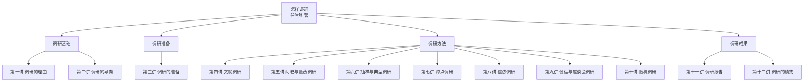

> **书籍信息**：《怎样调研》——机关工作实务丛书，任仲然著，党建读物出版社2019年5月出版，全书166千字，共十二讲。
> **核心命题**：调查研究是基础性工作、路径性选择、关键性要求、根本性方法，是联系群众的工作大平台和主要抓手。

## 全书知识图谱总览

全书以"为什么调研→调研什么→怎么准备→用什么方法→形成什么成果→取得什么绩效"为逻辑主线，构建了完整的调研方法论体系。

---

## 模块一：调研基础（第一讲～第二讲）

### 第一讲 调研的理由

| 核心要点 | 内容拆解 |
|-|-|
| 毛泽东的三大志愿 | ①下放搞一年工业、一年农业、半年商业，多调查研究不当官僚主义；②骑马到黄河长江两岸实地考察（地质矿产、历史文化、江河沿线三大领域）；③写一部书把一生写进去。前两大志愿都是亲自下去搞调查研究。 |
| 邓小平的四次讲话 | ①1956年党的八大关于修改党章的报告，严肃指出不调查研究的危害；②1961年3月19日《根本的工作方法就是调查研究实事求是》，概括五个方面问题，提出"大同"与"小异"两个调研维度，"坐而言要少，起而行要多"；③1961年3月27日《大跃进以来的教训是调查研究很少》，指出实事求是就是对实际情况真正了解；④1961年4月3日《根据各地特点进行农村调查》，对中央调查组提三层要求。 |
| 认知规律与群众路线 | 正确认知的直接来源是亲身实际经历和调查研究。"纸上得来终觉浅，绝知此事要躬行。"调查研究是基础性工作、路径性选择、关键性要求、根本性方法，是联系群众的工作大平台和主要抓手。 |
| 各级干部应具备调研力 | 调研力排在干部十大能力第二位（仅次于学习力）。调研力可分解为五种能力：以小见大/以个别见一般/以现象见趋势见规律的能力；发现问题/分析问题/解决问题的能力；去粗取精/去伪存真/把握真相本质的能力；发现先进典型/总结提炼概括经验的能力；作出决策/制定政策/提出措施的能力。 |

> **金句**："没有调查研究就没有发言权，没有调查研究就没有决策权。"——毛泽东
> **金句**："坐而言要少，起而行要多。"——邓小平

### 第二讲 调研的导向

| 核心要点 | 内容拆解 |
|-|-|
| 不能让调查成为问题 | 1961年中央办公厅下放长辛店机车车辆厂的工作人员写成《关于"调查研究"的调查》，指出普遍存在"十多十少"问题。毛泽东批示标题为《调查成灾的一例》。当下调研存在五个问题：只有调查没有研究；只有研究没有调查；调查不深入研究不系统；不懂调查不会研究；调查漫无边际研究没有主题。 |
| 目的和目标导向 | 调研不能盲目任意无主题，不能为了调研而调研。端正目的应在五方面用力：搞清真实情况；发现和提出问题；发现各地各单位好做法；为作出决策制定政策而调研；推动决策政策和工作任务落实。目标要具体，像GPS定位导航，像苍鹰起飞——动态目标与定位目标双重精确。 |
| 基层和基础导向 | 眼睛往下看，脚步往下走，精力往下使。到最基层的"微单位""微组织"——党小组、车间班组、机关股室、村民小组。基层的深入程度决定调研的实质深度，实质深度决定根本质量，根本质量决定实际成效。 |
| 社会现实问题导向 | "问题是时代的声音。"问题导向实质就是时代导向。要解决好五个方面：清楚什么是社会现实问题；坚定不移从社会现实问题出发；"没问题"是最大的问题；善于发现和正确提出重要问题；深入研究和推动问题的解决。 |
| 求实求真求是导向 | 调研最核心的是"三求"——求实居一，求真居二，求是居三。求实：对现实存在的敬畏，对事实真相的尊重，对基层和群众的接纳。求真：涉及真实、真相、真谛、真理，最高层次是求真谛求真理。求是："是"包括对规律的探求、对纠错、求道理、求正邪。 |

---

## 模块二：调研准备（第三讲）

### 第三讲 调研的准备

| 核心要点 | 内容拆解 |
|-|-|
| 精确课题，精练主题 | 费孝通指出社会调查第一步是定题阶段。课题类型：综合性课题、专项性课题、交叉性课题、跨界性课题。主题准备分两步：在精确课题基础上提炼概括，将主要内容由课题层面跃升到主题层面；把主题的标尺与靶心校准。 |
| 选择合适的调研方式 | 三个着眼点：①调研方式要为课题需求量身定做，没有"万能钥匙"只有"专用钥匙"；②调研方式要主动自觉为主题服务，主题决定方式，方式紧扣主题；③调研方式要善于打"组合拳"，点上搞深度调研，面上搞广度调研，点与面交替进行。 |
| 研学相关政策，掌握业务知识 | 不能指望"空手套白狼"，调研者头脑中要有思想、心中要有路数、手中要有管用的工具。研学政策是特别重要的准备，要找准调研的标尺。业务知识准备有个好方法是虚心向专家请教。"三门"干部（家门、校门、机关门）进入调研角色通常比较慢。 |
| 拟定纲目，配强力量 | 调研最重要的准备是设计好调研大纲。纲目要便于与调研报告提纲承转过渡，有水平的调研纲目实际上就是调研报告的初步提纲。陈云1973年给中国人民银行提出涉及国际金融和货币的十个问题的调研纲目，四点启示：要有宽广的视野；要求能量化的尽量量化；要立足搞清情况还要有预测研判的要求；要聚焦以便突出重点内容。 |
| 搞好动员培训，传授调研方法 | 只要是组成若干小组的调研，都有必要进行动员培训。要明确调研目的，理清工作思路，作出责任分工。调研组宜实行扁平化管理，不宜搞多余的管理层级。动员培训既要解决目的和任务问题，也要解决方法的问题——过河的船和桥，砍柴的刀和斧，开锁的钥匙。 |

---

## 模块三：调研方法（第四讲～第十讲）

### 第四讲 文献调研

| 核心要点 | 内容拆解 |
|-|-|
| 文献调研的广义内涵 | 文献是个大概念，包括传统纸质文献和现代信息技术承载的多媒体文献。文献调研是相对于实地现场的直接调研来说的，带有间接性。三点特别重要：①文献调研应该作为各种调研的前置；②文献调研属于经常性和动态性的调研，是调研者每日都要上的"必修课"；③文献调研要特别注意筛选甄别，确保获得的材料可信可靠可用。 |
| 马克思文献调研的"中国专题" | 马克思没有来过中国，主要通过文献调研观察诠释中国的动荡形势和外交困局。1853-1858年发表《中国革命和欧洲革命》《俄国的对华贸易》等文章。材料运用顺序：亲身观察到的事实→可靠的权威官方文件→用对立面破绽或矛盾之处的材料→确信真实无误的来自其他方面的材料。 |
| 在公文资料中调研 | 三个渠道：①上级公文资料的调研渠道——吃透下面的真实情况和吃透上级的主要精神，"两个吃透"缺一不可；②本地本部门公文资料的调研渠道——搞清本级相关工作来龙去脉的沿革；③横向公文资料的调研渠道——了解发改、财政、税务、金融等部门政策措施，了解兄弟省市做法。 |
| 在互联网和手机搜索中调研 | 接到调研任务，要做的第一件事就应当是文献调研，而文献调研要做的第一件事便是网络和手机搜索。移动互联网调研是快车道、大平台、低成本、零距离的调研。还要避免吃别人嚼过吃剩的馍。 |

### 第五讲 问卷调研和量表调研

| 核心要点 | 内容拆解 |
|-|-|
| 问卷调研的基本特征 | 问卷分为自填式问卷和访问式问卷。四个基本特征：①标的性较强；②主要围绕专题进行——一次问卷调研只设定一个专题；③要做到贴切和确切；④要力求结构化和规范化。 |
| 问题分类与答项设置 | 两大类：①封闭类问题——选择型、填空型、矩阵型、顺序型、等级型、表格型；②开放类问题——只向调研对象提出问题，不提供任何具体答案。需要量化统计的问卷调研应当尽量少使用开放类问题。 |
| 量表调研的四种类型 | ①总加量表——"是"统计1分，"不是"统计0分，全部得分相加得总分；②李克特量表——由两项选择增加到五项选择（非常同意/同意/无所谓/不同意/很不同意）；③语义差异量表——由一系列两极性形容词词对组成；④社会距离量表——用于测量人际关系远近亲疏。 |
| 加强量化研究 | 毛泽东强调"胸中有'数'"——对情况和问题一定要注意到它们的数量方面，要有基本的数量的分析。任何质量都表现为一定的数量，没有数量也就没有质量。数据分析一定要建立在真实的基础上。 |
| 防止简单化 | 在问卷中不可使用诱导性、倾向性问句，应站在"第三方"的客观公正立场上。答项设计要注意：答项与题目的相关性；各个答项之间应处于一个等级上；各答项的互斥性——疑似重复的答项一个也不要有。 |

### 第六讲 抽样调研和典型调研

| 核心要点 | 内容拆解 |
|-|-|
| 设计抽样调研的主要考量 | 三个方面：①抽样框要充分考量涵盖面——找到一份基本能涵盖所有总体元素的清单；②样本规模要充分考量代表性——量可以决定质，但规模过大不经济；③确定样本要充分考量等概率——总体的每个元素都有一个已知的、非零的被抽取选择的概率。 |
| 七种抽样调研类型 | 前四种属随机性抽样：①简约单纯抽样；②间隔等距抽样（机械随机抽样）；③分层级分类分阶段抽样；④聚类群体抽样。后三种属非随机性抽样：⑤偶遇便捷抽样；⑥立意判断抽样；⑦"滚雪球"抽样。 |
| 典型调研的实用价值 | 典型调研是抽样调研的一种高级形式——抽取具有一定代表性的典型作为样本，进行深度翔实的调研。要选先进典型、落后典型、中间典型三类，先进占15%，落后占15%，中间状态占70%。 |
| "大县城战略"调研 | 作者通过"三部曲"调研形成"大县城战略"：第一部曲从破解问题着手，用3年多时间跑遍全省100多个县；第二部曲放开视野走出去调研，进行比较研究；第三部曲加大典型调研力度，对呈现出大县城态势的20多个县做动态跟踪调研，最后锁定9个县。全县80%以上的经济总量、85%以上的财政收入、90%以上的居民消费集中在大县城实现。 |

### 第七讲 蹲点调研

| 核心要点 | 内容拆解 |
|-|-|
| 三深入：基层、实际、群众 | 蹲点调研的主要特征和要求就是"三深入"：导向更加注重深入基层，内容和形式更加注重深入实际，着眼点和着力点更加注重深入群众。深入群众是最重要、最关键的深入，也是最需要真情、最不容易的深入。 |
| 刘少奇天华调研 | 1961年4月底5月初，刘少奇在湖南长沙县福临公社天华大队住了18天。刚进驻时听到的都是夸夸其谈，水分很大。后来找党总支原副书记段树成谈话，知道了粮食产量、养猪数、工分值都是虚报的情况。三点启示：①听真话不容易；②蹲点调研解剖麻雀，不但要看身体结构和各种器官，还要发现病灶研究病理；③蹲点调研若遇到严重问题就应该多用一些时间，不可来去匆匆回避矛盾。 |
| 陈云青浦调研 | 1961年6月下旬至7月上旬，陈云在小蒸公社住了15天。他每天上午到农户走访，同时到公社的工厂、商店、仓库等处调研。写出《母猪也应该下放给农民私养》《种双季稻不如种蚕豆和单季稻》《按中央规定留足自留地》三份调研报告。算细账：双季稻比单季稻各项损失加起来折合310斤至330斤稻谷，不如种单季稻合算。 |
| 蹲"活点"不蹲"死点" | 蹲点调研一定要从实际需要出发，不要为了蹲点而蹲点。有的调研点可以作为长期的调研联系点，一年去几次，一次蹲几天，动态地跟踪调研。蹲点调研可以与跑面调研结合。 |
| 老石驻村调研实录 | 老石到许村驻村调研，不打招呼，悄悄在村里住下，尽可能做到"村不扰民、县不扰官"。进村后第一件事是向村支书提出找农活干。与三位老人种地，了解到农机种地价格每亩涨了10块钱，柴油种子化肥价格都涨了不少。在村会计家看到土地承包和户籍档案，全村1500亩耕地地块非常小而且特别分散。 |

### 第八讲 信访调研

| 核心要点 | 内容拆解 |
|-|-|
| 来信来访是重要的调研资源 | 机关干部了解掌握情况主要有五条渠道，最能反映底层情况、社会矛盾、各方面问题的，无疑是群众来信来访这条特殊渠道。 |
| 信访调研必须有真情有责任感 | 信访调研最重要的不是方法对不对路的问题，而是对人民群众有没有感情和政治责任感强不强的问题。胡耀邦为我们作出了榜样——1978年兄弟俩闯进时任中央组织部部长胡耀邦的家里申述母亲冤案，胡耀邦亲自翻阅材料，后来冤案得到彻底平反。 |
| 机关干部在信访岗位上的收获 | 对局处级所有干部进行全员信访岗位工作锻炼，新进机关的干部起码要在信访岗位工作三个月。信访调研的"六多"：多问、多听、多沟通、多观察、多学习、多思考。 |
| 新加坡"民情联系组"做法 | 新加坡建立了多元民意收集反馈机制。民情联系组设主席一人，通过选举在国会议员中产生，下设一个由25名国会议员组成的监察委员会，每届任期两年。每个民意团有12名成员，拥有调查权、检查权、建议权三项权力。 |

### 第九讲 谈话调研和座谈会调研

| 核心要点 | 内容拆解 |
|-|-|
| 谈话是各种调研的主要手段 | 谈话调研可分为结构化谈话调研和非结构化谈话调研。直接谈话是调研双方面对面的交流，语言沟通的直接性及互动性是其本质属性。问与答是谈话调研的基本要素，问答之间能够对被调研者进行有效观察。 |
| 设法听真话，忌偏听偏信 | 一要找知道真实情况的人谈话；二要找能说真话的人谈话，不要让可能影响讲真话的人参加谈话。毛泽东提醒过，找生产队长谈话，就不要让公社书记、大队长参加，找群众谈话就不要让干部参加。"群众不讲真话，不怪群众，只怪自己。"提问、倾听、回应、引导、概要、结论，是主谈人必备的基本功，提问是首要的基本功。 |
| 寻乌调查与兴国调查 | 1930年5月，毛泽东在寻乌工作生活了34天，做了20多天社会调查，开了10多天调查会。寻乌调查是毛泽东一生所作的规模最大、材料最丰富、收获最大的一次调查研究，获得了《寻乌调查》和《反对本本主义》两个重要成果。1930年10月，毛泽东与兴国县8位农民以调查会形式搞了"兴国调查"，初步制定了土地革命路线。 |
| 毛泽东七点调查技术 | ①要开调查会作讨论式的调查；②调查会到些什么人——要是能深切明了社会经济情况的人；③开调查会人多好还是人少好——看调查人的指挥能力，至少需要三人；④要定调查纲目——纲目要事先准备；⑤要亲身出马——不能单靠书面报告；⑥要深入——要了解一处地方或者一个问题的底里；⑦要自己做记录——假手于人是不行的。 |

### 第十讲 随机调研

| 核心要点 | 内容拆解 |
|-|-|
| 随机调研的必要性和可行性 | 随机，原本就是调研的基本特征，随机调研就是调研的本来面目。实行随机调研的好处有五点：①回归调研的本真，便于了解真实情况；②可以发现倾向性、普遍性、深层次的问题；③加强与群众的直接联系；④有利于对政策和工作要求是否符合实际作出研判评估；⑤有力推动路线方针政策和各项任务的落实。 |
| 胡耀邦的二十五天三千六百里路 | 1961年，胡耀邦搞了一次横跨三个省的随机调研。9月4日从北京出发，到达山东德州后换乘吉普车直奔鲁西南的聊城、金乡县开展随机调研。9月27日上火车后与随行人员研究起草调研报告，仅用一天时间就写成了上报中央的调研报告初稿《二十五天三千六百里路的农村察看》。毛泽东看到后批示："此件写得很好，印发各同志，值得一看。" |
| 把握随机调研的四个基调 | ①充分信任和尊重基层干部；②立足于听真话查实情；③致力于发现问题和研究解决问题；④侧重于研判评估工作，提出具体整改措施。 |
| 完善随机调研机制 | 老石在机关里推行随机调研，重点抓了四项工作：①有计划有安排、有序有效开展——机关每年都制订随机调研计划；②积极稳妥拓展覆盖面——市级领导任期内至少对所有乡镇做一次随机调研，县级领导至少对所有建制村做一次；③防止和克服不良倾向——"摘刺""采蜜"两手抓；④坚持经常形成常态——每季度要有两到三周时间下去搞随机调研。 |

---

## 模块四：调研成果（第十一讲～第十二讲）

### 第十一讲 调研报告

| 核心要点 | 内容拆解 |
|-|-|
| 边调查研究，边起草报告 | 三点看法：①高质量的调研报告主要不是写出来的，而是认认真真调查出来研究出来的；②调研报告不应该有条条框框，真正需要集中精力的是真、实、深、高这四个字；③调研过程就应该是写调研报告的过程，千万不可把调研与写报告分割成两个阶段。 |
| 五类常用调研报告的写法 | ①情况类调研报告——关键是要把情况写实写准；②问题类调研报告——不赞成写成"四段式"，主张"有一条写一条"的问题并列结构；③经验类调研报告——特别忌讳面面俱到和绝对化；④研究类调研报告——要放开三个角度的视野：立足于"新"、聚力于"深"、要着眼于"专"；⑤历史类调研报告——还原历史本来面目，厘清真相或疑点。 |
| 向朱德学习撰写调研报告 | 1961年朱德到四川、陕西、河南等地调研，给毛泽东写了一份调研报告。全文仅3000余字，涉及政治经济和生产生活各个领域。朱德的表述特点基本上是转述，有农民群众的诉求，有基层干部的看法，也有地方党委的意见，但他把自己的立场态度和观点主张融入其中，并且都落脚在政策建议上了。 |
| 起草调研报告的五点心得 | 其一，主题越聚焦越好——一题一报告；其二，结构越简约越好——不搞复杂烦琐的叠床架屋；其三，表述越朴实越好——善于用鲜活事实和具体数据说话；其四，观点和结论越鲜明越好——到了呼之欲出的节骨眼上再惜墨如金地精确表述；其五，修改越认真越好——五分精力写初稿，五分精力改报告，热写稿，冷改稿。 |
| "问答式"调研报告 | 2005年作者到A省和B省调研，专门找农民工聊天，采取"问答式"写法，自问自答了五个问题：①我国目前有多少农民工？②农民工属于什么阶层？③农民工处于何种生存境况？④农民工问题有多么重要？⑤解决农民工问题应该做些什么？ |

### 第十二讲 调研的绩效

| 核心要点 | 内容拆解 |
|-|-|
| 从调研到作出决策——陈云的宝钢调研 | 1979年，上海宝钢建设项目何去何从成了最大焦点。总投资近20亿美元。中央决定委托陈云对宝钢项目作出决策。陈云先是在北京听取汇报、查阅资料，5月31日专程到上海调研，以便获得现场情况和第一手材料。 |
| 从调研到纠正错误——邓子恢的龙岩调研 | 邓子恢通过深入龙岩调研，发现并纠正了农村工作中的错误。调研是纠正错误的重要途径。 |
| 从调研到成果转化——周恩来的两次调研 | 周恩来相隔二十年的两次调研，展示了调研成果如何便捷转化为实际工作成果。 |
| 从调研到理论创造——费孝通的社会调查 | 费孝通通过对开弦弓村的调查，开始认知和剖析中国农村社会重大问题。调研不仅是了解情况、解决问题的手段，更是思想理论创造的源泉。 |
| 从调研到推动落实——老石的随机调研 | 调研的最终目的是推动工作落实，调研成果要转化为实际行动和工作成效。 |

---

## 调研方法对比速查表

| 调研方式 | 核心特征 | 适用场景 | 主要优势 | 注意事项 |
|-|-|-|-|-|
| 文献调研 | 间接性、经常性、动态性 | 调研前置准备、日常积累 | 成本低、覆盖面广 | 注意筛选甄别，避免吃别人嚼过的馍 |
| 问卷调研 | 标的性、专题性、结构化 | 大样本量化调查 | 可量化统计、便于比较 | 问题设计要贴切，答项要互斥 |
| 量表调研 | 量化测量主观态度 | 满意度测评、态度测量 | 可精确量化主观感受 | 要有正向、负向、中性答项 |
| 抽样调研 | 从总体中抽取样本 | 大范围情况调查 | 工作量小、可推断总体 | 抽样框要涵盖面广，样本要有代表性 |
| 典型调研 | 选取代表性典型深度调研 | 经验总结、问题剖析 | 深度翔实、可解剖麻雀 | 典型要选准，三类都要选 |
| 蹲点调研 | 住下来深入调研 | 基层情况摸底 | 深入细致、感情贴近 | 蹲"活点"不蹲"死点"，时间要充分 |
| 信访调研 | 从来信来访中发现问题 | 社情民意掌握 | 直接反映底层情况 | 要有真情和责任感 |
| 谈话调研 | 面对面个别交流 | 深入了解情况 | 直接互动、可深入追问 | 要设法听真话，忌偏听偏信 |
| 座谈会调研 | 集体讨论式调查 | 多方意见征集 | 效率高、可相互启发 | 参加人员要有代表性 |
| 随机调研 | 不打招呼、随机选点 | 真实情况掌握 | 真实性强、推动落实 | 要信任尊重基层，要形成常态 |

---

## 经典案例索引

| 序号 | 案例名称 | 所在章节 | 核心启示 |
|-|-|-|-|
| 1 | 毛泽东寻乌调查 | 第九讲 | 规模最大、材料最丰富的调查研究，开调查会作讨论式调查，亲身出马，自己做记录 |
| 2 | 毛泽东兴国调查 | 第九讲 | 与8位农民开调查会，初步制定土地革命路线 |
| 3 | 邓小平四次讲话 | 第一讲 | 根本的工作方法就是调查研究实事求是，"坐而言要少，起而行要多" |
| 4 | 刘少奇天华调研 | 第七讲 | 18天蹲点调研，听真话不容易，要敢于担当 |
| 5 | 陈云青浦调研 | 第七讲 | 15天蹲点调研，算细账，写三份调研报告，求真务实 |
| 6 | 陈云宝钢调研 | 第十二讲 | 从调研到作出决策的典范 |
| 7 | 恩格斯《英国工人阶级状况》 | 第六讲 | 典型调研的经典，21个月亲身观察 |
| 8 | 胡耀邦25天3600里路 | 第十讲 | 随机调研的典范，一天写成调研报告初稿 |
| 9 | 朱德调研报告 | 第十一讲 | 3000余字反映五个方面情况，把立场融入群众意见，落脚在政策建议 |
| 10 | 老石"猪周期"追踪 | 第十一讲 | 双休日跑6个县市，纪实性调研报告，两天形成报告 |
| 11 | 老石驻村调研实录 | 第七讲 | 不打招呼沉下去，与农民同劳动，了解真实情况 |
| 12 | "大县城战略"调研 | 第六讲 | "三部曲"调研：破解问题→比较研究→典型跟踪 |
| 13 | 马克思文献调研"中国专题" | 第四讲 | 没来过中国却通过文献调研洞察万里之外的中国 |
| 14 | 胡耀邦接待"上访" | 第八讲 | 信访调研要有真情和责任感，推动冤案平反 |
| 15 | 新加坡民情联系组 | 第八讲 | 多元民意收集反馈机制，变被动接访为主动下访 |

---

## 核心金句摘录

> "没有调查研究就没有发言权，没有调查研究就没有决策权。"——毛泽东
>
> "坐而言要少，起而行要多。"——邓小平
>
> "纸上得来终觉浅，绝知此事要躬行。"——陆游
>
> "问题是时代的声音。"——马克思
>
> "胸中有'数'。"——毛泽东
>
> "群众不讲真话，不怪群众，只怪自己。"——毛泽东
>
> "我的经验历来如此，凡是忧愁没有办法的时候，就去调查研究，一经调查研究，办法就出来了，问题就解决了。"——毛泽东
>
> "如果不这样做，则官越大，真理越少。大官如此，小官也是如此。"——毛泽东
>
> "调查研究是基础性工作、路径性选择、关键性要求、根本性方法。"——本书作者
>
> "调研上瘾的干部，几乎百分之百都是好干部。"——本书作者

---

*—— 全书知识图谱完 ——*
